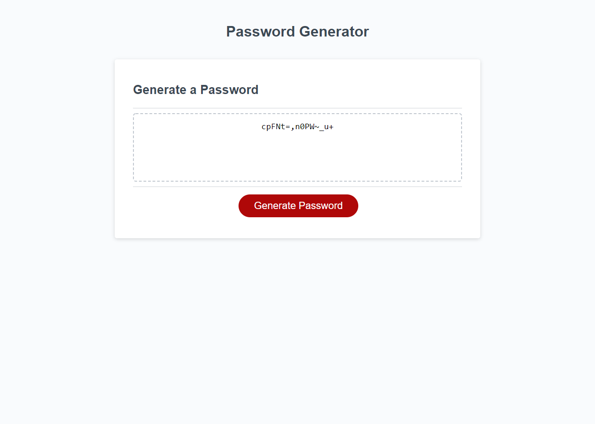

# Random Password Generator

Modified starter code provided in order to create an application that allows users to generate a random
password based on criteria they select.

## Screenshots

## Objectives
Main Objective: When the button is clicked a new, secure password is created for the user

- The user is presented with a series of prompts for password criteria to choose from
- The password length must be at least 8 characters and no more than 128 characters
- The user can choose whether or not to include lowercase, uppercase, numeric, and/or special characters
- This choice is validated and taken into account when generating teh password
- The password is then displayed on the page
## Link

[Link to finshed webpage](https://emily-mvaz.github.io/password-generator/)

## Contributions
I used information I found on [Stack Overflow](https://stackoverflow.com/questions/23097859/javascript-prompt-validation), [MDN Webdocs](https://developer.mozilla.org/en-US/docs/Web/JavaScript/Reference/Global_Objects/Array/join), and [W3Schools](https://www.w3schools.com/jsref/jsref_while.asp) to help me understand how to join arrays, use while loops, and validate responses in my code.

I also recieved a great deal of help from two of my peers, Vidal and Neema who were able to look over my code and help me rewrite areas where I previously had errors or could not get to function properly.

## License

[MIT](https://choosealicense.com/licenses/mit/)

